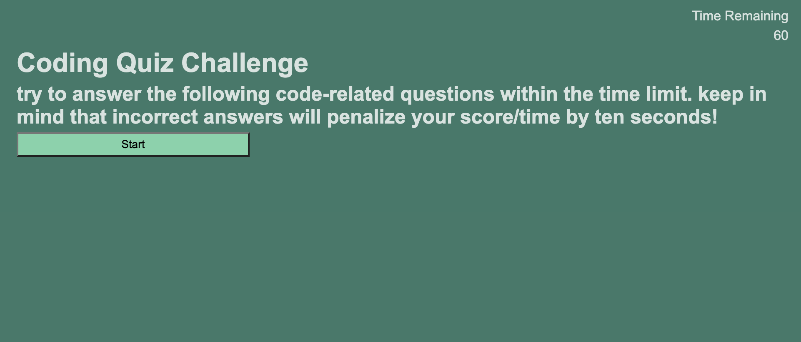

# code-quiz

## Description

This page is a simple coding quiz. It will record and keep track of your local scores. 

Link to deployed site: https://internetethan.github.io/code-quiz/

## Installation

N/A

## Usage

Select the start button to begin the quiz, read each question and select the correct answer. Each incorrect answer will reduce the time remaining by 10 seconds. Your score is dependent on the time remaining. 

## License

MIT License

---
